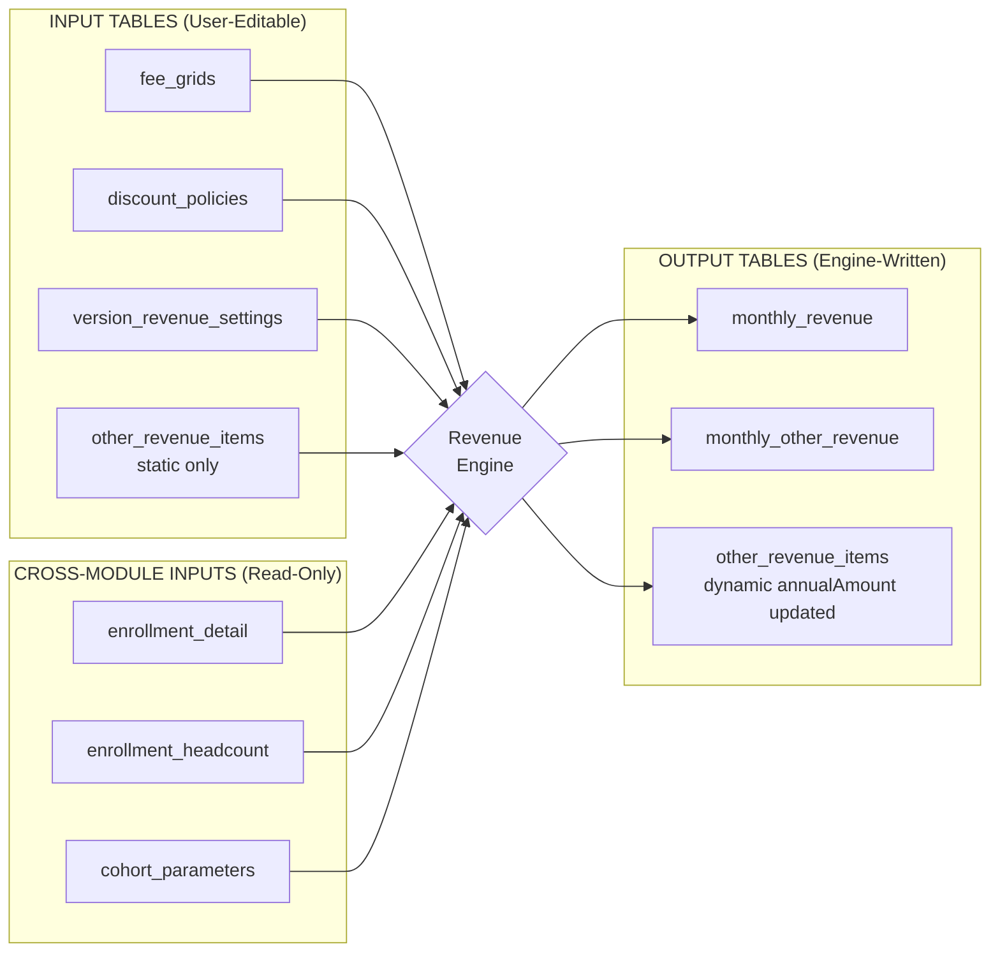
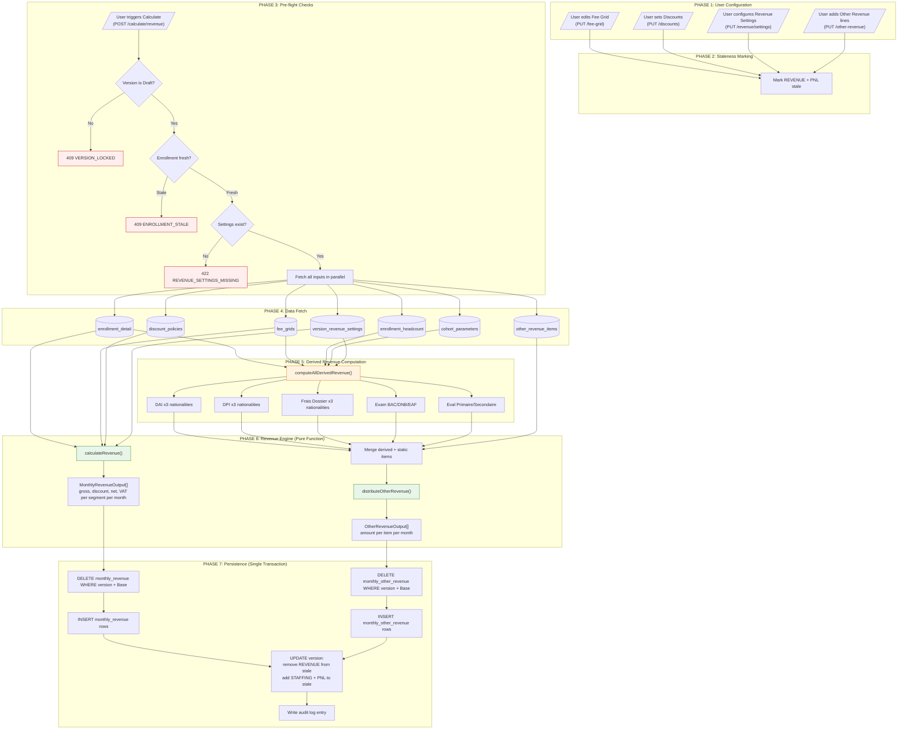
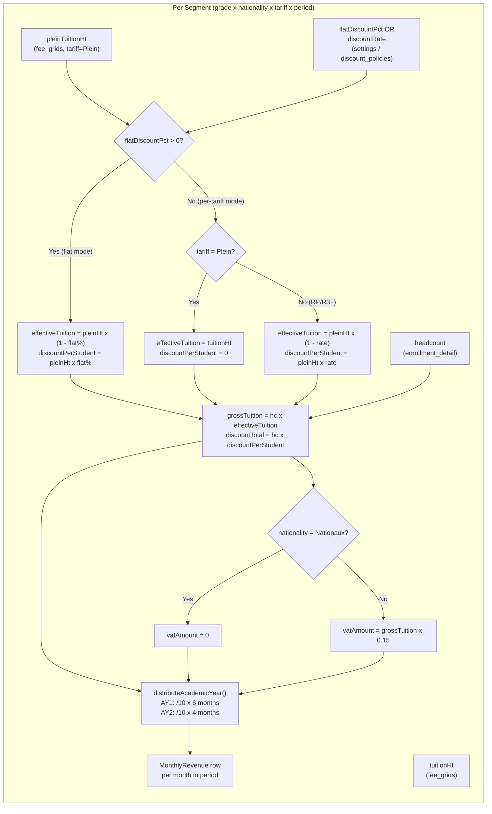
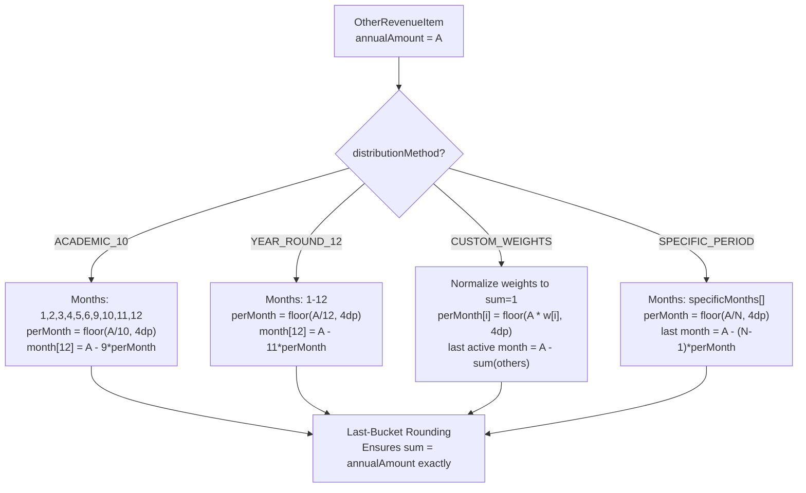
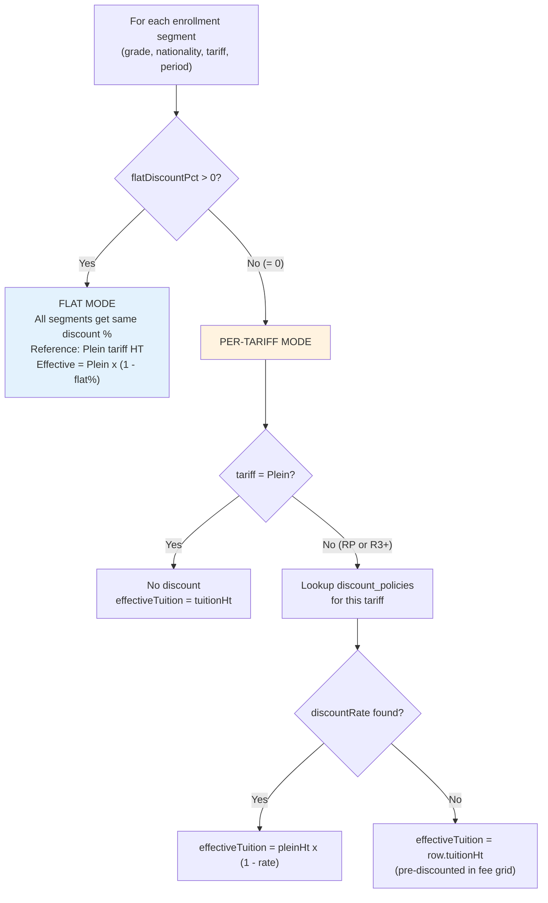
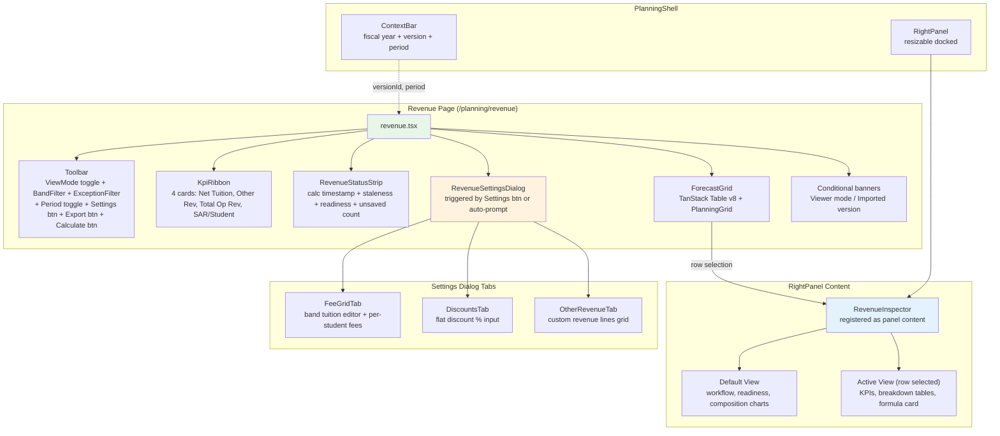
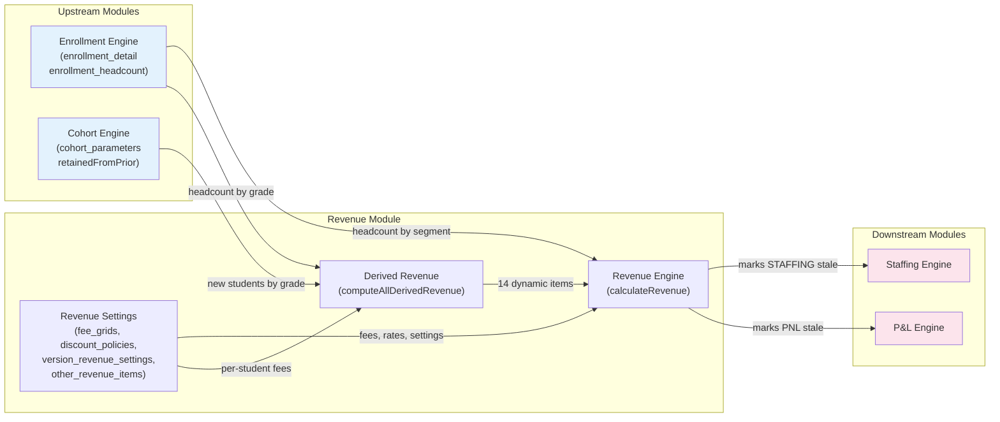
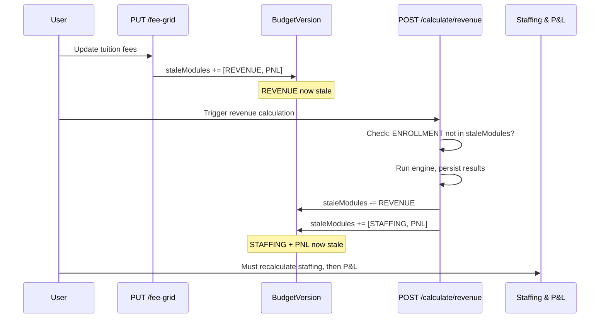

# Revenue Module — Complete Audit Report

**Date:** 2026-03-16
**Branch:** `codex/epic-17-revenue-remediation` (historical — audit performed against this branch)
**Auditor:** Claude (Opus 4.6)
**Scope:** Full data-flow tracing — database, API, calculation engine, frontend — for every revenue category

---

## Table of Contents

1. [Executive Summary](#1-executive-summary)
2. [Revenue Category Inventory](#2-revenue-category-inventory)
3. [Database Schema](#3-database-schema)
4. [Data Flow Architecture](#4-data-flow-architecture)
5. [API Route Map](#5-api-route-map)
6. [Calculation Engine Deep Dive](#6-calculation-engine-deep-dive)
7. [Frontend Architecture](#7-frontend-architecture)
8. [Cross-Module Dependencies](#8-cross-module-dependencies)
9. [Stale Flag Propagation](#9-stale-flag-propagation)
10. [Findings & Improvement Proposals](#10-findings--improvement-proposals)

---

## 1. Executive Summary

The revenue module computes **monthly projected revenue** for EFIR across two academic semesters (AY1: Jan-Jun, AY2: Sep-Dec) within a fiscal year. Revenue is version-scoped — every input setting and calculated output belongs to a `BudgetVersion`.

**Two distinct revenue streams exist:**

| Stream              | Source                                                | # of Output Rows                                                             |
| ------------------- | ----------------------------------------------------- | ---------------------------------------------------------------------------- |
| **Tuition Revenue** | Enrollment headcount x Fee grid x Discounts           | Up to `grades(15) x nationalities(3) x tariffs(3) x months(10)` = 1,350 rows |
| **Other Revenue**   | 14 dynamic items (computed) + N static items (manual) | `items x applicable_months`                                                  |

**FY2026 reference totals** (from engine calculation outputs and test fixtures — not independently verified against a canonical external source):

| IFRS Category               | FY2026 Total (SAR) | % of Revenue |
| --------------------------- | ------------------ | ------------ |
| Tuition Fees                | 58,972,254         | 86.5%        |
| Discount Impact             | (2,333,713)        | -3.4%        |
| Registration Fees           | 9,810,050          | 14.4%        |
| Activities & Services       | 1,312,800          | 1.9%         |
| Examination Fees            | 394,800            | 0.6%         |
| **TOTAL OPERATING REVENUE** | **68,156,191**     | **100.0%**   |

---

## 2. Revenue Category Inventory

This is the master reference table. For each revenue line, it traces **where the data originates**, whether it is a user input or a cross-module dependency, and which formula produces it.

### 2.1 Tuition Revenue

```text
Formula: headcount x effectiveTuitionHT / 10 academic months
         distributed across AY1 (6 months) and AY2 (4 months)
```

| Data Element             | Source Table               | Source Type                      | Entered Where                    | Notes                                          |
| ------------------------ | -------------------------- | -------------------------------- | -------------------------------- | ---------------------------------------------- |
| Headcount per segment    | `enrollment_detail`        | Cross-module (Enrollment engine) | Enrollment page                  | Broken by (period, grade, nationality, tariff) |
| Tuition TTC              | `fee_grids`                | User input                       | Revenue Settings > Fee Grid tab  | Per (period, grade, nationality, tariff)       |
| Tuition HT               | `fee_grids`                | User input (validated)           | Revenue Settings > Fee Grid tab  | Must satisfy: `HT = TTC / (1 + vatRate)`       |
| DAI (admission fee)      | `fee_grids`                | User input                       | Revenue Settings > Fee Grid tab  | Used only for Other Revenue DAI calculation    |
| Flat discount %          | `version_revenue_settings` | User input                       | Revenue Settings > Discounts tab | Single % applied uniformly to Plein rate       |
| Per-tariff discount rate | `discount_policies`        | User input                       | Revenue Settings > Discounts tab | Legacy fallback when flatDiscountPct = 0       |
| VAT rate                 | Hardcoded constant         | System                           | N/A                              | 15% for non-Nationaux, 0% for Nationaux        |

### 2.2 Dynamic Other Revenue (14 Canonical Items)

These are **system-computed** from enrollment data + per-student fee settings. Users cannot edit the `annualAmount` — it is recalculated on every engine run.

#### DAI — Droit d'Admission (3 items by nationality)

| Data Element              | Source                                        | Type             |
| ------------------------- | --------------------------------------------- | ---------------- |
| AY2 enrollment headcount  | `enrollment_detail` (AY2 rows)                | Cross-module     |
| DAI per student per grade | `fee_grids.dai` (AY2 rows)                    | User input       |
| **Formula**               | `SUM(headcount x dai)` grouped by nationality |                  |
| Distribution              | `SPECIFIC_PERIOD` months [5, 6]               | Canonical config |
| IFRS Category             | Registration Fees                             |                  |

#### DPI — Droit Pedagogique d'Inscription (3 items by nationality)

| Data Element       | Source                                            | Type                         |
| ------------------ | ------------------------------------------------- | ---------------------------- |
| New student count  | `cohort_parameters` (retainedFromPrior)           | Cross-module (Cohort engine) |
| DPI per student HT | `version_revenue_settings.dpi_per_student_ht`     | User input                   |
| **Formula**        | `newStudentsByNationality[nat] x dpiPerStudentHt` |                              |
| Distribution       | `SPECIFIC_PERIOD` months [5, 6]                   | Canonical config             |
| IFRS Category      | Registration Fees                                 |                              |

#### Frais de Dossier — Application Fee (3 items by nationality)

| Data Element           | Source                                                | Type                         |
| ---------------------- | ----------------------------------------------------- | ---------------------------- |
| New student count      | `cohort_parameters` (retainedFromPrior)               | Cross-module (Cohort engine) |
| Dossier per student HT | `version_revenue_settings.dossier_per_student_ht`     | User input                   |
| **Formula**            | `newStudentsByNationality[nat] x dossierPerStudentHt` |                              |
| Distribution           | `SPECIFIC_PERIOD` months [5, 6]                       | Canonical config             |
| IFRS Category          | Registration Fees                                     |                              |

#### Examination Fees (3 items)

| Exam | Grade Filter           | Setting Field          | Distribution  |
| ---- | ---------------------- | ---------------------- | ------------- |
| BAC  | `TERM` (AY1 headcount) | `exam_bac_per_student` | months [4, 5] |
| DNB  | `3EME` (AY1 headcount) | `exam_dnb_per_student` | months [4, 5] |
| EAF  | `1ERE` (AY1 headcount) | `exam_eaf_per_student` | months [4, 5] |

| Data Element                   | Source                                 | Type         |
| ------------------------------ | -------------------------------------- | ------------ |
| AY1 headcount for target grade | `enrollment_headcount`                 | Cross-module |
| Per-student exam fee           | `version_revenue_settings`             | User input   |
| **Formula**                    | `headcount[grade] x examFeePerStudent` |              |
| IFRS Category                  | Examination Fees                       |              |

#### Evaluation Fees (2 items)

| Eval Type  | Grade Band | Grades Included        | Setting Field                 | Distribution    |
| ---------- | ---------- | ---------------------- | ----------------------------- | --------------- |
| Primaire   | Elementary | CP, CE1, CE2, CM1, CM2 | `eval_primaire_per_student`   | months [10, 11] |
| Secondaire | Secondary  | 6EME-TERM              | `eval_secondaire_per_student` | months [10, 11] |

| Data Element         | Source                                        | Type         |
| -------------------- | --------------------------------------------- | ------------ |
| New students by band | `cohort_parameters` (retainedFromPrior)       | Cross-module |
| Per-student eval fee | `version_revenue_settings`                    | User input   |
| **Formula**          | `newStudentsByBand[band] x evalFeePerStudent` |              |
| IFRS Category        | Registration Fees                             |              |

### 2.3 Static Other Revenue (User-Defined)

These are **manually entered** fixed amounts with user-chosen distribution.

| Data Element                         | Source                                        | Type       |
| ------------------------------------ | --------------------------------------------- | ---------- |
| Line item name                       | `other_revenue_items.line_item_name`          | User input |
| Annual amount                        | `other_revenue_items.annual_amount`           | User input |
| Distribution method                  | `other_revenue_items.distribution_method`     | User input |
| Weight array (if CUSTOM_WEIGHTS)     | `other_revenue_items.weight_array` (JSONB)    | User input |
| Specific months (if SPECIFIC_PERIOD) | `other_revenue_items.specific_months` (INT[]) | User input |
| IFRS category                        | `other_revenue_items.ifrs_category`           | User input |

Examples: APS (After-School Activities), Daycare, Class Photos, Donations, PSG Academy Rental.

---

## 3. Database Schema

### 3.1 Entity-Relationship Diagram

```mermaid
erDiagram
    BudgetVersion ||--o{ FeeGrid : "has many"
    BudgetVersion ||--o{ DiscountPolicy : "has many"
    BudgetVersion ||--o| VersionRevenueSettings : "has one"
    BudgetVersion ||--o{ OtherRevenueItem : "has many"
    BudgetVersion ||--o{ MonthlyRevenue : "has many (output)"
    BudgetVersion ||--o{ MonthlyOtherRevenue : "has many (output)"
    BudgetVersion ||--o{ EnrollmentDetail : "has many"
    BudgetVersion ||--o{ EnrollmentHeadcount : "has many"
    BudgetVersion ||--o{ CohortParameter : "has many"

    FeeGrid {
        int id PK
        int versionId FK
        string academicPeriod "AY1 | AY2"
        string gradeLevel "PS..TERM (15 values)"
        string nationality "Francais | Nationaux | Autres"
        string tariff "Plein | RP | R3+"
        decimal_15_4 dai "admission fee HT"
        decimal_15_4 tuitionTtc "tuition incl VAT"
        decimal_15_4 tuitionHt "tuition excl VAT"
        decimal_15_4 term1Amount
        decimal_15_4 term2Amount
        decimal_15_4 term3Amount
        int createdBy FK
    }

    DiscountPolicy {
        int id PK
        int versionId FK
        string tariff "RP | R3+"
        decimal_7_6 discountRate "0.000000 to 1.000000"
        int createdBy FK
    }

    VersionRevenueSettings {
        int id PK
        int versionId FK "UNIQUE (1:1)"
        decimal_15_4 dpiPerStudentHt
        decimal_15_4 dossierPerStudentHt
        decimal_15_4 examBacPerStudent
        decimal_15_4 examDnbPerStudent
        decimal_15_4 examEafPerStudent
        decimal_15_4 evalPrimairePerStudent
        decimal_15_4 evalSecondairePerStudent
        decimal_7_6 flatDiscountPct "0=per-tariff mode"
        int createdBy FK
    }

    OtherRevenueItem {
        int id PK
        int versionId FK
        string lineItemName "UNIQUE per version"
        decimal_15_4 annualAmount
        string distributionMethod "ACADEMIC_10 | YEAR_ROUND_12 | CUSTOM_WEIGHTS | SPECIFIC_PERIOD"
        jsonb weightArray "nullable, 12 floats"
        int_array specificMonths "nullable, month nums"
        string ifrsCategory
        string computeMethod "nullable: DAI | DPI | etc."
        int createdBy FK
    }

    MonthlyRevenue {
        int id PK
        int versionId FK
        string scenarioName "default: Base"
        string academicPeriod
        string gradeLevel
        string nationality
        string tariff
        smallint month "1-12"
        decimal_15_4 grossRevenueHt "OUTPUT"
        decimal_15_4 discountAmount "OUTPUT"
        decimal_15_4 scholarshipDeduction "OUTPUT"
        decimal_15_4 netRevenueHt "OUTPUT"
        decimal_15_4 vatAmount "OUTPUT"
        int calculatedBy FK
    }

    MonthlyOtherRevenue {
        int id PK
        int versionId FK
        string scenarioName "default: Base"
        string lineItemName
        string ifrsCategory
        string executiveCategory "nullable"
        smallint month "1-12"
        decimal_15_4 amount "OUTPUT"
        int calculatedBy FK
    }

    EnrollmentDetail {
        int id PK
        int versionId FK
        string academicPeriod
        string gradeLevel
        string nationality
        string tariff
        int headcount "INPUT from enrollment engine"
    }

    EnrollmentHeadcount {
        int id PK
        int versionId FK
        string academicPeriod
        string gradeLevel
        int headcount "aggregate by grade"
    }

    CohortParameter {
        int id PK
        int versionId FK
        string gradeLevel
        decimal retainedFromPrior "used for new student calc"
    }
```



### 3.2 Input vs Output Tables



### 3.3 Precision Rules

| Field Type           | PostgreSQL       | Decimal.js Rounding               | Example         |
| -------------------- | ---------------- | --------------------------------- | --------------- |
| Monetary amounts     | `DECIMAL(15,4)`  | `ROUND_HALF_UP` to 4dp            | 58972254.0000   |
| Discount/VAT rates   | `DECIMAL(7,6)`   | N/A (stored as-is)                | 0.150000 (15%)  |
| Monthly distribution | `DECIMAL(15,4)`  | `ROUND_DOWN` to 4dp + last-bucket | 5897225.4000    |
| Headcount            | `INTEGER`        | N/A                               | 42              |
| Weight array         | `JSONB` (floats) | Normalized to sum=1               | [0.1, 0.1, ...] |

---

## 4. Data Flow Architecture

### 4.1 End-to-End Revenue Calculation Pipeline



### 4.2 Tuition Revenue Calculation Detail



### 4.3 Other Revenue Distribution Methods



---

## 5. API Route Map

### 5.1 Complete Route Table

Config and results routes (rows 1-11) are prefixed with `/api/v1/versions/:versionId/`.
The calculate route (row 12) is registered under a **separate prefix**: `/api/v1/versions/:versionId/calculate/`.

| #   | Method | Full Path                 | Auth | RBAC            | Request Body                   | Response                                                                                           | Stale Effect              |
| --- | ------ | ------------------------- | ---- | --------------- | ------------------------------ | -------------------------------------------------------------------------------------------------- | ------------------------- |
| 1   | GET    | `.../revenue/settings`    | Auth | —               | —                              | `{ settings }`                                                                                     | —                         |
| 2   | PUT    | `.../revenue/settings`    | Auth | Admin/BO/Editor | 7 fee fields + flatDiscountPct | `{ settings }`                                                                                     | +REVENUE, +PNL            |
| 3   | GET    | `.../fee-grid`            | Auth | —               | ?academic_period               | `{ entries[] }`                                                                                    | —                         |
| 4   | GET    | `.../fee-grid/prior-year` | Auth | —               | —                              | `{ entries[], priorFiscalYear }`                                                                   | —                         |
| 5   | PUT    | `.../fee-grid`            | Auth | Admin/BO/Editor | `{ entries[] }` (batch)        | `{ updated: N }`                                                                                   | +REVENUE, +PNL            |
| 6   | GET    | `.../discounts`           | Auth | —               | —                              | `{ entries[] }`                                                                                    | —                         |
| 7   | PUT    | `.../discounts`           | Auth | Admin/BO/Editor | `{ entries[] }` (tariff+rate)  | `{ updated: N }`                                                                                   | +REVENUE, +PNL            |
| 8   | GET    | `.../other-revenue`       | Auth | —               | —                              | `{ items[] }`                                                                                      | —                         |
| 9   | PUT    | `.../other-revenue`       | Auth | Admin/BO/Editor | `{ items[] }` (batch)          | `{ updated: N }`                                                                                   | +REVENUE, +PNL            |
| 10  | GET    | `.../revenue/readiness`   | Auth | —               | —                              | `{ feeGrid, discounts, otherRevenue, overallReady }`                                               | —                         |
| 11  | GET    | `.../revenue`             | Auth | —               | ?academic_period, ?group_by    | `{ entries[], otherRevenueEntries[], summary, totals, rowCount, revenueEngine, executiveSummary }` | —                         |
| 12  | POST   | `.../calculate/revenue`   | Auth | Admin/BO/Editor | (empty)                        | `{ runId, durationMs, summary, tuitionRowCount, otherRevenueRowCount }`                            | -REVENUE, +STAFFING, +PNL |

> **Note on PUT responses (rows 5, 7, 9):** These return `{ updated: N }` (the count of upserted rows), NOT the updated collections. Only `PUT /revenue/settings` (row 2) returns the full persisted object.

### 5.2 Route Registration

```typescript
// apps/api/src/index.ts (lines 69-74):
app.register(revenueRoutes, { prefix: '/api/v1/versions/:versionId' });
app.register(revenueCalculateRoutes, { prefix: '/api/v1/versions/:versionId/calculate' });
// revenueCalculateRoutes defines handler as app.post('/revenue', ...)
// so the full path is: POST /api/v1/versions/:versionId/calculate/revenue
```

### 5.3 Validation Rules on Write Routes

| Route              | Validation                                                     | Error Code                      | HTTP |
| ------------------ | -------------------------------------------------------------- | ------------------------------- | ---- |
| PUT /fee-grid      | `tuitionHt = tuitionTtc / (1 + vatRate)` within 0.01 tolerance | `VAT_MISMATCH`                  | 422  |
| PUT /fee-grid      | AY2 DAI consistent across tariffs for same grade/nationality   | `DAI_MISMATCH`                  | 422  |
| PUT /discounts     | Rate must be in [0, 1]                                         | `INVALID_DISCOUNT_RATE`         | 422  |
| PUT /other-revenue | Custom weights must have positive total                        | `INVALID_WEIGHT_ARRAY`          | 422  |
| PUT /other-revenue | Line item names unique per version                             | `DUPLICATE_LINE_ITEM`           | 422  |
| PUT /other-revenue | Dynamic items match canonical config                           | `DYNAMIC_OTHER_REVENUE_INVALID` | 422  |
| All PUT routes     | Version must be Draft status                                   | `VERSION_LOCKED`                | 409  |
| POST /calculate    | Enrollment must not be stale                                   | `ENROLLMENT_STALE`              | 409  |
| POST /calculate    | Revenue settings must exist                                    | `REVENUE_SETTINGS_MISSING`      | 422  |

---

## 6. Calculation Engine Deep Dive

### 6.1 File Map

| File                                         | Purpose                                             | Lines |
| -------------------------------------------- | --------------------------------------------------- | ----- |
| `apps/api/src/services/revenue-engine.ts`    | Pure calculation functions (no DB)                  | ~490  |
| `apps/api/src/services/derived-revenue.ts`   | Dynamic item computation (DAI, DPI, exams, evals)   | ~533  |
| `apps/api/src/services/revenue-config.ts`    | 14 canonical dynamic items + defaults               | ~274  |
| `apps/api/src/services/revenue-reporting.ts` | Reporting view builder (matrix + executive summary) | ~479  |
| `apps/api/src/routes/revenue/calculate.ts`   | Orchestration route (fetch, validate, run, persist) | ~393  |

### 6.2 Constants

```typescript
VAT_RATE = new Decimal('0.15'); // 15% for non-Nationaux
ZERO = new Decimal(0);
ONE = new Decimal(1);
ACADEMIC_MONTHS = new Decimal(10); // 6 (AY1) + 4 (AY2)
AY1_MONTHS = [1, 2, 3, 4, 5, 6]; // Jan-Jun
AY2_MONTHS = [9, 10, 11, 12]; // Sep-Dec
```

### 6.3 Formula Reference

| Calculation                     | Formula                                        | Rounding        |
| ------------------------------- | ---------------------------------------------- | --------------- |
| Effective tuition (flat mode)   | `pleinHt x (1 - flatDiscountPct)`              | 4dp HALF_UP     |
| Effective tuition (tariff mode) | `pleinHt x (1 - discountRate)` or fee row HT   | 4dp HALF_UP     |
| Discount per student            | `pleinHt - effectiveTuition`                   | 4dp HALF_UP     |
| Annual gross tuition            | `headcount x effectiveTuition`                 | 4dp HALF_UP     |
| Annual discount total           | `headcount x discountPerStudent`               | 4dp HALF_UP     |
| VAT (non-Nationaux)             | `grossTuition x 0.15`                          | 4dp HALF_UP     |
| VAT (Nationaux)                 | `0`                                            | —               |
| Monthly portion                 | `annualTotal / 10`                             | 4dp DOWN        |
| Last month (AY1 or AY2)         | `annualTotal - sum(otherMonths)`               | exact remainder |
| DAI total                       | `SUM(headcount_AY2 x dai_AY2)` by nationality  | 4dp HALF_UP     |
| DPI total                       | `newStudents x dpiPerStudentHt` by nationality | 4dp HALF_UP     |
| Exam fee                        | `headcount[grade] x examFeePerStudent`         | 4dp HALF_UP     |
| Eval fee                        | `newStudentsByBand x evalFeePerStudent`        | 4dp HALF_UP     |

### 6.4 Discount Resolution Logic



### 6.5 Last-Bucket Rounding (Critical for Financial Integrity)

```text
Given: annualTotal = 58,972,254.0000, months = 10

Step 1: perMonth = floor(58,972,254.0000 / 10, 4dp) = 5,897,225.4000
Step 2: allocated = 5,897,225.4000 x 9 = 53,075,028.6000
Step 3: lastMonth = 58,972,254.0000 - 53,075,028.6000 = 5,897,225.4000

Result: All months get exactly 5,897,225.4000 (no rounding drift)
```

This technique guarantees `SUM(monthly) = annual` with zero precision loss.

---

## 7. Frontend Architecture

### 7.1 Component Tree

> **Note:** This is a simplified structural view. The actual page also includes: period toggle, export button, settings button, viewer/imported-version banners, and conditional filter controls.



### 7.2 TanStack Query Hook Map

| Hook                    | API Endpoint             | Query Key                                  | Invalidates on Mutation            |
| ----------------------- | ------------------------ | ------------------------------------------ | ---------------------------------- |
| `useFeeGrid`            | GET /fee-grid            | `['revenue','fee-grid', vid, period]`      | —                                  |
| `usePriorYearFees`      | GET /fee-grid/prior-year | `['revenue','fee-grid','prior-year', vid]` | —                                  |
| `useDiscounts`          | GET /discounts           | `['revenue','discounts', vid]`             | —                                  |
| `useOtherRevenue`       | GET /other-revenue       | `['revenue','other-revenue', vid]`         | —                                  |
| `useRevenueSettings`    | GET /revenue/settings    | `['revenue','settings', vid]`              | —                                  |
| `useRevenueReadiness`   | GET /revenue/readiness   | `['revenue','readiness', vid]`             | —                                  |
| `useRevenueResults`     | GET /revenue             | `['revenue','results', vid, mode, period]` | —                                  |
| `usePutFeeGrid`         | PUT /fee-grid            | —                                          | fee-grid, readiness, versions      |
| `usePutDiscounts`       | PUT /discounts           | —                                          | discounts, readiness, versions     |
| `usePutOtherRevenue`    | PUT /other-revenue       | —                                          | other-revenue, readiness, versions |
| `usePutRevenueSettings` | PUT /revenue/settings    | —                                          | settings, readiness, versions      |
| `useCalculateRevenue`   | POST /calculate/revenue  | —                                          | results, versions                  |

### 7.3 Zustand Stores

| Store                           | Purpose                               | Key State                            |
| ------------------------------- | ------------------------------------- | ------------------------------------ |
| `revenue-settings-dialog-store` | Dialog open/close + active tab        | `isOpen`, `activeTab`                |
| `revenue-settings-dirty-store`  | Track unsaved changes per tab         | `dirtyFields: Map<Tab, Set<string>>` |
| `revenue-selection-store`       | Selected grid row for inspector       | `selection: RowIdentity \| null`     |
| `workspace-context-store`       | Fiscal year, version, period (global) | `versionId`, `academicPeriod`        |

---

## 8. Cross-Module Dependencies

### 8.1 Dependency Graph



### 8.2 Cross-Module Data Dependencies (Detail)

| Revenue Needs                     | From Module      | DB Table               | Join Key                                                     |
| --------------------------------- | ---------------- | ---------------------- | ------------------------------------------------------------ |
| Student headcount per segment     | Enrollment       | `enrollment_detail`    | (versionId, academicPeriod, gradeLevel, nationality, tariff) |
| Aggregate headcount per grade     | Enrollment       | `enrollment_headcount` | (versionId, academicPeriod, gradeLevel)                      |
| Retained-from-prior counts        | Cohort           | `cohort_parameters`    | (versionId, gradeLevel)                                      |
| Fiscal year for prior-year lookup | Version metadata | `budget_version`       | versionId                                                    |
| Prior-year actual version ID      | Fiscal periods   | `fiscal_period`        | (fiscalYear - 1, actualVersionId NOT NULL)                   |

**Important:** There is NO direct foreign key between `enrollment_detail` and `fee_grids`. They are joined in application logic by the composite key `(versionId, academicPeriod, gradeLevel, nationality, tariff)`. This is a design choice — see Findings section.

---

## 9. Stale Flag Propagation

### 9.1 Staleness Cascade



### 9.2 What Triggers Staleness

| Action                            | Modules Marked Stale                 |
| --------------------------------- | ------------------------------------ |
| PUT /fee-grid                     | REVENUE, PNL                         |
| PUT /discounts                    | REVENUE, PNL                         |
| PUT /revenue/settings             | REVENUE, PNL                         |
| PUT /other-revenue                | REVENUE, PNL                         |
| POST /calculate/revenue (success) | Removes REVENUE, adds STAFFING + PNL |
| Enrollment recalculation          | Adds REVENUE (upstream)              |

### 9.3 Blocking Rules

| Calculation | Blocked If           | Error                |
| ----------- | -------------------- | -------------------- |
| Revenue     | ENROLLMENT is stale  | 409 ENROLLMENT_STALE |
| Staffing    | (checked separately) | —                    |
| P&L         | (checked separately) | —                    |

---

## 10. Findings & Improvement Proposals

### 10.1 Solid Patterns (What's Working Well)

| #   | Pattern                                                                                       | Assessment |
| --- | --------------------------------------------------------------------------------------------- | ---------- |
| 1   | **Pure calculation engine** — `calculateRevenue()` has zero side effects, fully testable      | Excellent  |
| 2   | **Last-bucket rounding** — guarantees monthly sums match annual totals exactly                | Excellent  |
| 3   | **Decimal.js everywhere** — no floating-point in any monetary path                            | Excellent  |
| 4   | **Version scoping** — all tables FK to BudgetVersion with CASCADE delete                      | Solid      |
| 5   | **Stale flag propagation** — clear upstream/downstream dependency chain                       | Solid      |
| 6   | **Canonical dynamic items** — 14 computed revenue lines validated against config              | Solid      |
| 7   | **Audit trail** — `createdBy`/`updatedBy` on inputs, `calculatedBy`/`calculatedAt` on outputs | Solid      |
| 8   | **Single-transaction persistence** — delete + insert in one DB transaction                    | Correct    |
| 9   | **Readiness endpoint** — 3-area pre-flight check before calculation                           | Good UX    |

### 10.2 Inconsistencies & Risks

#### FINDING-01: No FK Between Enrollment and Fee Grid (Medium Risk)

**Issue:** `enrollment_detail` and `fee_grids` share the same composite key `(versionId, academicPeriod, gradeLevel, nationality, tariff)` but have no database-level foreign key or referential constraint.

**Impact:** It is possible to have enrollment rows for segments that have no matching fee grid entry (or vice versa). The engine silently produces zero revenue for unmatched segments.

**Current Mitigation:** The readiness endpoint checks that fee grid entries exist, but does not cross-validate against enrollment segments.

**Proposal:** Add a `GET /revenue/validation` endpoint that returns mismatched segments:

```json
{
    "enrollmentWithoutFees": [{ "gradeLevel": "PS", "nationality": "Autres", "tariff": "R3+" }],
    "feesWithoutEnrollment": [{ "gradeLevel": "TERM", "nationality": "Francais", "tariff": "RP" }]
}
```

This gives the user visibility into data gaps without enforcing a rigid FK (which would create painful ordering constraints).

---

#### FINDING-02: Scholarship Deduction Field Is Never Populated (Low Risk)

**Issue:** `MonthlyRevenue.scholarshipDeduction` exists in the schema with `DECIMAL(15,4) DEFAULT 0` but the revenue engine never computes or writes a non-zero value. There is no scholarship model, no scholarship input table, and no UI for scholarships.

**Impact:** The field is always 0. It is included in the API response and in the `netRevenueHt` formula conceptually (`net = gross - discount - scholarship`) but scholarship is effectively a no-op.

**Proposal:** Two options:

- **Option A (Recommended):** Keep the field as a placeholder for v2 scholarship feature. Document it as "reserved" in the spec.
- **Option B:** Remove the field and simplify `netRevenueHt = grossRevenueHt - discountAmount`. Add it back when scholarships are implemented.

---

#### FINDING-03: Dual Discount Modes Create Complexity (Medium Risk)

**Issue:** The system supports two discount modes:

1. **Flat mode** (`flatDiscountPct > 0`): Uniform percentage applied to Plein rate for all segments
2. **Per-tariff mode** (`flatDiscountPct = 0`): Legacy `discount_policies` table consulted per tariff

The mode is determined by a single field (`flatDiscountPct`) — if it's > 0, flat mode wins and `discount_policies` is ignored entirely.

**Impact:**

- Users may set discount policies AND a flat rate, not realizing the policies are being ignored
- The `discount_policies` table retains stale data when flat mode is active
- The Discounts tab UI only shows the flat % input, making per-tariff policies invisible

**Proposal:** Add a clear mode indicator:

- Show "Flat discount active — per-tariff policies are not applied" banner when flat > 0
- Consider deprecating per-tariff mode entirely if EFIR always uses flat (per ADR-029 decision)
- If keeping both, add a radio toggle: "Flat discount" vs "Per-tariff discount" in the Discounts tab

---

#### FINDING-04: VAT Rate Is Hardcoded (Low Risk)

**Issue:** The 15% VAT rate is a constant in `revenue-engine.ts`:

```typescript
const VAT_RATE = new Decimal('0.15');
```

It is not stored in the database, not configurable via settings, and not in the `Assumption` table.

**Impact:** If KSA changes the VAT rate (it was raised from 5% to 15% in 2020), a code change + deployment is required. For a single-tenant on-premise system, this may be acceptable.

**Proposal:** Move VAT rate to `VersionRevenueSettings` or the `Assumption` table to make it configurable per version without code changes. This is low priority but would improve maintainability.

---

#### FINDING-05: Delete-and-Reinsert Pattern for Monthly Results (Low Risk)

**Issue:** Every calculation run deletes ALL existing `monthly_revenue` and `monthly_other_revenue` rows for the version, then reinserts fresh rows. This is done in a transaction.

**Impact:**

- Safe for correctness (clean slate each time)
- Could cause temporary gaps if a concurrent read hits during the transaction
- Row IDs are not stable across runs (auto-increment)

**Proposal:** The current approach is simple and correct. An upsert pattern would preserve row IDs but adds complexity. **Keep as-is** unless concurrent reads become a problem (unlikely for single-tenant deployment).

---

#### FINDING-06: Evaluation Fee Double-Counting Inflates Total Operating Revenue (High Risk)

**Issue:** In `revenue-reporting.ts:158-161`, `mapOtherRevenueLines()` maps evaluation items to **two** reporting buckets simultaneously:

```typescript
// revenue-reporting.ts:158-161
if (lineItemName.startsWith('Evaluation')) {
    return ['New Student Fees (Dossier+DPI)', 'Evaluation Tests'];
}
```

At `revenue-reporting.ts:247-256`, the calling code adds the evaluation amount to **both** `otherRevenueByLine` keys. Then at line 270-275, `registrationTotal` sums all three registration labels — including both buckets that contain evaluation. This flows directly into `totalOperatingRevenue` at lines 292-296.

**Impact:** Evaluation fee amounts are **double-counted** in:

1. The "Total Registration Fees" subtotal in the revenue engine matrix
2. The "Registration Fees" line in the executive summary
3. The "TOTAL OPERATING REVENUE" figure in both views

This is not just a labeling issue — the **aggregate totals are arithmetically inflated** by the evaluation fee amount. The code comment at line 159 says "Workbook parity," suggesting this mirrors an existing Excel workbook structure. If the original workbook intentionally double-counts evaluation as a disclosure technique, this is a conscious design choice. But if not, it is a real financial reporting error.

**Proposal:** Investigate and resolve:

- **Step 1:** Verify whether the original EFIR Excel workbook double-counts evaluation in its totals. If yes, document this as an intentional "workbook parity" choice in an ADR.
- **Step 2:** If the workbook does NOT double-count: change `mapOtherRevenueLines` to return only `['Evaluation Tests']` for evaluation items, and add them to their own subtotal separate from "New Student Fees."
- **Step 3:** If keeping the dual mapping for disclosure purposes: add evaluation to "New Student Fees" only for the detail matrix view, but exclude it from the `registrationLineLabels` array used in `registrationTotal` to prevent inflating the aggregate. Alternatively, use a separate "memo" row that is not summed into totals.

---

#### FINDING-07: No Concurrency Control on Calculate (Low Risk)

**Issue:** The revenue calculation route has no explicit locking mechanism. If two users trigger `POST /calculate/revenue` simultaneously for the same version, both will read the same inputs, delete existing rows, and insert their own results. The last writer wins.

**Current Mitigation:** The version must be in Draft status, and EFIR likely has very few concurrent users.

**Proposal:** Add an advisory lock or a "calculating" status flag on the version to prevent concurrent runs. This is low priority for a single-tenant system but would be essential for multi-tenant.

---

#### FINDING-08: `term1Amount`, `term2Amount`, `term3Amount` Are Not Used in Calculations (Info)

**Issue:** The `fee_grids` table stores `term1_amount`, `term2_amount`, and `term3_amount` fields, and they are user-editable in the API. However, the revenue engine does NOT use these fields — it uses only `tuitionHt` for the annual total and distributes it evenly across academic months.

**Impact:** These fields are informational only — they represent the payment schedule for families but do not affect revenue recognition timing.

**Proposal:** Document this clearly in the spec. If term-based revenue recognition is ever needed (IFRS 15 timing), these fields would become inputs to the engine. **Keep as-is** for now.

---

#### FINDING-09: Potential Seed Data Drift Between Assumption Table and VersionRevenueSettings (Low Risk)

**Issue:** The revenue engine reads exclusively from `VersionRevenueSettings`. The `Assumption` table also contains revenue-related keys (e.g., `examBacPerStudent`), and the `DEFAULT_VERSION_REVENUE_SETTINGS` in `revenue-config.ts` defines a separate set of defaults. If the seed files for the `Assumption` table and `VersionRevenueSettings` were ever written independently, their values may have diverged.

**Impact:** The `Assumption` table is not consumed by the revenue engine at runtime — `VersionRevenueSettings` is the sole source of truth. Any divergence is a documentation/maintenance issue, not a calculation bug. However, this audit did not exhaustively diff every seed file to confirm or deny drift.

**Proposal:** Either:

- Remove revenue-related keys from the `Assumption` table (since `VersionRevenueSettings` is the runtime source of truth)
- Or sync the values and use `Assumption` as the canonical default seed source for new `VersionRevenueSettings` records

---

#### FINDING-10: Frontend Fetches All Results Then Filters Client-Side (Info)

**Issue:** The `useRevenueResults` hook fetches all monthly revenue rows from the API, then `buildRevenueForecastGridRows()` and `filterRevenueForecastRows()` process and filter them client-side.

**Impact:** For EFIR's scale (~1,350 tuition rows + ~150 other revenue rows per version), this is fine. The data fits easily in memory.

**Proposal:** **Keep as-is.** Server-side filtering would add API complexity with no measurable benefit at this data scale. Only revisit if the system were to support multiple schools or significantly more granular data.

---

### 10.3 Summary Matrix

| #    | Finding                                    | Severity | Action                                      |
| ---- | ------------------------------------------ | -------- | ------------------------------------------- |
| F-01 | No FK between enrollment and fee grid      | Medium   | Add cross-validation endpoint               |
| F-02 | Scholarship field never populated          | Low      | Document as reserved for v2                 |
| F-03 | Dual discount modes create confusion       | Medium   | Add mode indicator in UI                    |
| F-04 | VAT rate hardcoded                         | Low      | Move to settings (future)                   |
| F-05 | Delete-and-reinsert for monthly results    | Low      | Keep as-is                                  |
| F-06 | Evaluation double-counting inflates totals | **High** | Verify workbook parity; fix reporting logic |
| F-07 | No concurrency control on calculate        | Low      | Add advisory lock (future)                  |
| F-08 | Term amounts not used in engine            | Info     | Document as payment-schedule only           |
| F-09 | Potential seed data drift (under-cited)    | Low      | Verify seed files; sync or remove           |
| F-10 | Client-side filtering of results           | Info     | Keep as-is (scale is fine)                  |

---

## Appendix A: File Manifest

### Backend

| File                                           | Purpose                                            |
| ---------------------------------------------- | -------------------------------------------------- |
| `apps/api/prisma/schema.prisma`                | Database schema (lines 604-754 for revenue models) |
| `apps/api/src/routes/revenue/index.ts`         | Route registration                                 |
| `apps/api/src/routes/revenue/calculate.ts`     | POST /calculate/revenue                            |
| `apps/api/src/routes/revenue/settings.ts`      | GET/PUT /revenue/settings                          |
| `apps/api/src/routes/revenue/fee-grid.ts`      | GET/PUT /fee-grid, GET /fee-grid/prior-year        |
| `apps/api/src/routes/revenue/discounts.ts`     | GET/PUT /discounts                                 |
| `apps/api/src/routes/revenue/other-revenue.ts` | GET/PUT /other-revenue                             |
| `apps/api/src/routes/revenue/readiness.ts`     | GET /revenue/readiness                             |
| `apps/api/src/routes/revenue/results.ts`       | GET /revenue                                       |
| `apps/api/src/services/revenue-engine.ts`      | Pure calculation engine                            |
| `apps/api/src/services/derived-revenue.ts`     | Dynamic item computation                           |
| `apps/api/src/services/revenue-config.ts`      | Canonical config + defaults                        |
| `apps/api/src/services/revenue-reporting.ts`   | Reporting view builder                             |

### Frontend

| File                                                          | Purpose                           |
| ------------------------------------------------------------- | --------------------------------- |
| `apps/web/src/pages/planning/revenue.tsx`                     | Main revenue page                 |
| `apps/web/src/hooks/use-revenue.ts`                           | All TanStack Query hooks          |
| `apps/web/src/components/revenue/revenue-settings-dialog.tsx` | 3-tab settings modal              |
| `apps/web/src/components/revenue/fee-grid-tab.tsx`            | Tuition + per-student fees editor |
| `apps/web/src/components/revenue/discounts-tab.tsx`           | Flat discount input               |
| `apps/web/src/components/revenue/other-revenue-tab.tsx`       | Custom revenue lines              |
| `apps/web/src/components/revenue/forecast-grid.tsx`           | Monthly revenue grid              |
| `apps/web/src/components/revenue/revenue-inspector.tsx`       | RightPanel detail inspector       |
| `apps/web/src/components/revenue/kpi-ribbon.tsx`              | 4 KPI cards                       |
| `apps/web/src/components/revenue/revenue-status-strip.tsx`    | Status indicators                 |
| `apps/web/src/components/revenue/revenue-matrix-table.tsx`    | Engine matrix view                |
| `apps/web/src/lib/revenue-workspace.ts`                       | Grid row building + filtering     |
| `apps/web/src/lib/revenue-readiness.ts`                       | Readiness area checks             |
| `apps/web/src/lib/fee-schedule-builder.ts`                    | Fee schedule structure builder    |
| `apps/web/src/stores/revenue-settings-dialog-store.ts`        | Dialog state                      |
| `apps/web/src/stores/revenue-settings-dirty-store.ts`         | Unsaved changes tracker           |
| `apps/web/src/stores/revenue-selection-store.ts`              | Row selection state               |

### Shared Types

| File                            | Purpose                                  |
| ------------------------------- | ---------------------------------------- |
| `packages/types/src/revenue.ts` | All revenue type definitions (221 lines) |

### Documentation

| File                                                 | Purpose                              |
| ---------------------------------------------------- | ------------------------------------ |
| `docs/specs/epic-2/revenue.md`                       | Original revenue spec                |
| `docs/specs/epic-16/revenue-workspace-redesign.md`   | UI redesign spec                     |
| `docs/adr/ADR-029-flat-discount-model.md`            | Flat discount architectural decision |
| `docs/plans/2026-03-13-revenue-page-redesign.md`     | Revenue page redesign plan           |
| `docs/plans/2026-03-15-epic-17-validation-report.md` | Epic 17 validation report            |
| `docs/tdd/04_api_contract.md` (lines 1425-1761)      | Revenue API contract spec            |
| `docs/tdd/02_component_design.md` (lines 264-582)    | Revenue data model spec              |
